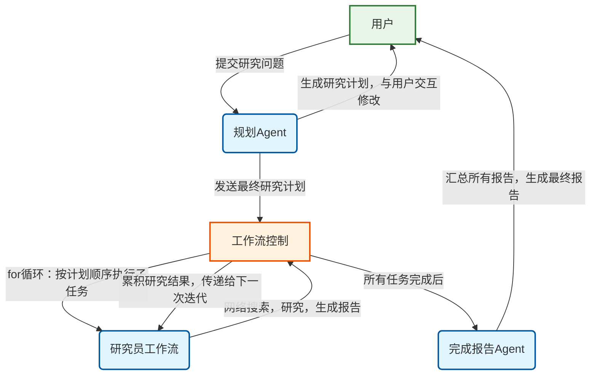

# 搜索类agent探索

**中文** | [English](readme_en.md)

本项目旨在探索使用agno框架实现的探索类agent。本文档记录对项目的初步设计以及后续落地，既为人类用户编写，也为AI编程工具提供参考。

> **开发说明**: 本项目主要以中文进行开发，英文相关的prompt内容会在后续逐渐补充。This project is primarily developed in Chinese. English-related prompt content and documentation will be gradually supplemented in future updates.

## 参考资料

### Agno相关
* [总览,提供了一个research agent的基本信息](https://docs.agno.com/agents/introduction)
* [运行Agent](https://docs.agno.com/agents/run)
* [prompt](https://docs.agno.com/agents/prompts)
* [使用工具](https://docs.agno.com/agents/tools)
* [多agent team](https://docs.agno.com/teams/introduction)
* [工作流](https://docs.agno.com/workflows_2/types_of_workflows)

## 安装及运行

### 安装
```bash
pip install -r requirements.txt
```

### 运行

`main.py` 是项目的统一命令行入口，提供了运行各种AI agent的接口。它具有以下功能：

- **统一入口**: 通过命令行参数选择不同的agent
- **Agent管理**: 自动检测和管理可用的agent
- **错误处理**: 提供友好的错误信息和使用提示
- **交互界面**: 包含项目横幅和详细的帮助信息

#### 基本用法
```bash
# 查看所有可用的agent
python main.py --list

# 运行简单搜索agent
python main.py simple-search

# 运行规划agent
python main.py planning

# 运行研究员agent
python main.py researcher

# 查看帮助信息
python main.py --help

# 查看版本信息
python main.py --version
```

#### 当前支持的Agent
- **simple-search**: 简单搜索Agent，使用搜索工具并总结网页内容
- **workflow-search**: 搜索工作流Agent，通过多agent工作流(生成查询->搜索->总结)完成搜索任务
- **planning**: 规划工作流 v2.0，采用固定工具流架构：规划生成 -> 计划展示 -> 反馈评估 -> 结构化输出，支持人机交互和计划迭代优化
- **researcher-workflow**: 研究员工作流，通过工作流实现详细报告生成和摘要生成的两步流程，支持多轮搜索、引用标注和反馈修改功能
- **deep-research**: 完整的深度研究系统，整合规划、研究、汇总三个阶段，自动生成结构化研究报告，包含详细的引用管理和最终报告生成


## 环境（向AI说明，仅限于开发者本人适用）
在执行测试代码前
```bash
conda activate agno-env
```

## Deep Research系统架构

### 系统概述
Deep Research系统是一个完整的AI驱动研究工具，能够根据用户输入的研究问题，自动生成研究计划、执行深度调研、并生成结构化的研究报告。系统采用多Agent协作架构，包含以下核心组件：

### 核心组件

#### 1. 规划Agent (Planning Agent)
- **文件位置**: `src/deep_research/planning_agent.py`
- **功能**: 根据用户问题生成结构化研究计划，支持人机交互优化
- **工作流程**: 规划生成 → 计划展示 → 用户反馈 → 计划调整 → 最终确认
- **输出**: 包含标题、概述和子任务列表的JSON格式研究计划

#### 2. 研究员工作流 (Researcher Workflow)
- **文件位置**: `src/deep_research/researcher_workflow.py`
- **功能**: 执行具体的研究任务，生成详细报告和摘要
- **工作流程**: 查询生成 → 联网搜索 → 报告撰写 → 摘要生成
- **输出**: 详细研究报告(Markdown)、研究摘要、搜索结果存储

#### 3. 完成报告Agent (Finish Agent)
- **文件位置**: `src/deep_research/finish_agent.py`
- **功能**: 汇总所有研究结果，生成最终的完整研究报告
- **组件**: 标题引言生成器、结论生成器、参考资料生成器
- **输出**: 完整的研究报告，包含引言、详细内容、结论和参考文献

#### 4. 引用管理系统 (Reference Manager)
- **文件位置**: `src/reference_manager/`
- **功能**: 管理搜索结果的存储、索引和引用标注
- **特性**: 自动生成引用标记、支持多种引用格式、防重复存储

### 输出结构

系统为每个研究任务创建独立的输出目录，包含以下文件：

```
<task_id>/
├── research_plan.json          # 研究计划
├── all_research_results.json   # 所有研究结果汇总
├── final_report.md            # 最终研究报告
├── research_reports/          # 各子任务的详细报告
│   ├── detailed_report_*.md   # 详细研究报告
│   └── summary_*.md          # 研究摘要
├── references/               # 引用资料
│   └── references_*.json     # 搜索结果和引用数据
└── summaries/               # 阶段性摘要(可选)
```

### 示例输出

项目包含完整的示例输出(`example_task/`)，展示了关于"深度学习历史"的系统性研究：
- **研究计划**: 6个子任务，涵盖从1943年到2025年的深度学习发展历程
- **详细报告**: 每个子任务生成约3000-5000字的深度分析报告
- **最终报告**: 超过20000字的完整研究报告，包含引言、详细分析、结论和参考文献
- **引用管理**: 自动标注的引用索引和完整的参考资料列表

## 项目设计

* .env文件存放有环境变量，因为比较敏感所以设置了忽略，下面介绍一下里面的字段
    * OPENAI_API_KEY存放有api key
    * OPENAI_API_BASE_URL存放有api base url
    * TAVILY_API_KEY存放有tavily api key，用于Tavily搜索工具
* src/custom_tools存放有自定义的工具
* src/explore是之前实验、探索agno使用方法的代码，之后的实现也可以参考
* reference是agno agent的具体实现(从agno包直接拷贝过来)
* 接下来项目的实现主要放在src文件夹下，每个文件夹代表一种实验
* 在prompts文件夹下存储prompt模板。在python代码中开发时，应将prompt模板的实现与代码分离，prompt模板的实现应放在prompts文件夹下，而python代码应放在src文件夹下。prompts的具体要求参考[Prompt设计规范](#prompt设计规范)
* 搜索工具使用custom_tools下面的tavily_tools_with_index，需要在.env文件中配置TAVILY_API_KEY。设置include_answer=False,format='json'以使其返回原始搜索结果.并将使用google搜索的代码以注释形式写在下一行，方便备选，例如：
```python
from custom_tools.tavily_tools_with_index import TavilyToolsWithIndex
agent = Agent(
...#其它参数
tools=[TavilyToolsWithIndex(include_answer=False,format='json')], 
#tools=[GoogleSearchTools(fixed_max_results=10)],
show_tool_calls=True)

```
* 对于AI工具来说，除非我明确，否则在开发完成后不用进行程序的运行和测试，而是将相关指令告诉我，由我来手动运行和测试

## Prompt设计规范

在设计prompt时，需要遵循以下规范：
* **prompt模板格式**：prompt模板应该以json形式创建。agno的模板可以分为description,instructions,goal等部分,具体可以参考[运行Agent](https://docs.agno.com/agents/run)这篇参考资料。对于我们这个项目，应当包含
    * description: 简要描述agent的角色及任务
    * instructions: 详细说明agent的工作流程、有哪些工具等
    * goal: 说明agent的目标
    * additional_context: 在这一部分加入限制条件，明确agent不能做什么（例如输出有害信息），以及其它限制（例如如果有调用外部工具次数的限制）
* **搜索工具语言设置**：由于都是国外的搜索工具，所以在使用时，除非是涉及到中国的内容，否则关键词最好是英文，区域/语言设置成英语。
* **语言适配指令**：应该添加根据用户提问语言选择回答语言的指令，即如果用户用中文提问则用中文回答，如果用户用英文提问则用英文回答。

## 开发目标

### 简单搜索agent

- [x] 1 实现一个简单的搜索agent，在这个agent内，用户可以输入一个问题，agent会自主调用搜索工具，搜索相关内容，最后返回总结的结果。限制只能调用一次工具
    - [x] 1.1 基本的搜索-总结内容实现
    - [x] 1.2 给搜索工具增加储存功能，把搜索到的内容储存到一个文件中
    - [x] 1.3 调整prompt，让模型在总结内容时，将生成内容与搜索结果相关的部分加上引用角标，引用角标格式为[1]、[2]等；在生成结果的末尾加上所有搜索结果的标题和链接
- [x] 2 实现一个搜索工作流。这个工作流包括多个agent，先用小模型生成提示词，接着使用搜索工具搜索相关内容，最后用大模型总结搜索结果

### deep research应用

实现一个deep research应用，这个应用的目标是根据用户输入的问题，自动生成一个研究计划，调用多个不同的agent进行合作，为用户生成一篇研究报告

#### 涉及agent
1. 规划agent: 这个agent首先会根据用户输入的问题，根据情况使用联网搜索工具，生成一个结构化的研究计划，该研究计划包含若干个子任务，并与用户进行交互，最后根据用户的反馈，调整研究计划。
2. 研究员agent： 这个agent的任务是根据提供的子任务，调用搜索工具进行联网搜索，搜索到相关内容后生成它这一部分的研究报告。研究员agent应将搜索到的内容储存起来（以json文件的形式），并输出它这一部分的详细研究报告和摘要，分别以markdown形式储存。通过for循环按研究计划的顺序依次执行各个子任务，每次执行时会获得之前所有研究结果的总结作为上下文。
3. 完成报告agent： 这个agent的任务是根据所有研究员agent的研究报告，生成最终的研究报告。研究报告应该根据一定的格式（以后再完善）生成。

#### 开发计划与实现状态

- [x] **1. 实现规划agent (Planning Agent) ✅**
    - [x] 1.1 创建规划agent的prompt模板 (v2.0: plan_generator_agent.json, feedback_evaluator_agent.json)
    - [x] 1.2 实现规划agent的核心逻辑 (v2.0: 重构为工作流架构)
    - [x] 1.3 集成搜索工具用于背景信息收集 (Tavily搜索工具)
    - [x] 1.4 实现人机交互的计划确认机制 (固定工具流设计)
    - [x] 1.5 添加计划展示和反馈收集功能 (独立的展示和评估组件)
    - [x] 1.6 测试规划agent的功能完整性 (v2.0测试文件)

- [x] **2. 实现研究员agent (Researcher Agent) ✅**
    - [x] 2.1 创建agent基础结构 (researcher_workflow.py)
    - [x] 2.2 集成联网搜索工具 (TavilyToolsWithIndex)
    - [x] 2.3 实现根据子任务生成研究报告的功能 (工作流架构)
    - [x] 2.4 实现搜索结果的存储和引用标注 (ReferenceManager集成)
    - [x] 2.5 实现根据反馈修改报告的功能
    - [x] 2.6 实现详细报告和摘要的分别生成与存储

- [x] **3. 实现完成报告agent (Finish Agent) ✅**
    - [x] 3.1 创建agent基础结构 (finish_agent.py)
    - [x] 3.2 定义最终研究报告的格式 (标题+引言+详细报告+结论+参考资料)
    - [x] 3.3 实现汇总所有研究结果并生成最终报告的功能
    - [x] 3.4 集成标题引言生成器、结论生成器和参考资料生成器

- [x] **4. 实现工作流控制逻辑 ✅**
    - [x] 4.1 实现for循环控制研究员agent按计划顺序执行 (deep_researcher.py)
    - [x] 4.2 实现研究结果的累积和传递机制 (all_research_results.json)
    - [x] 4.3 实现各agent之间的数据流转 (JSON文件存储与读取)
    - [x] 4.4 集成引用管理系统 (ReferenceManager)

- [x] **5. 整合与测试 ✅**
    - [x] 5.1 将所有agent集成为一个完整的工作流 (DeepResearcher类)
    - [x] 5.2 完善 `main.py` 以运行deep research应用
    - [x] 5.3 生成完整的示例输出 (example_task文件夹)
    - [x] 5.4 实现交互式研究流程

#### 系统工作流程图


