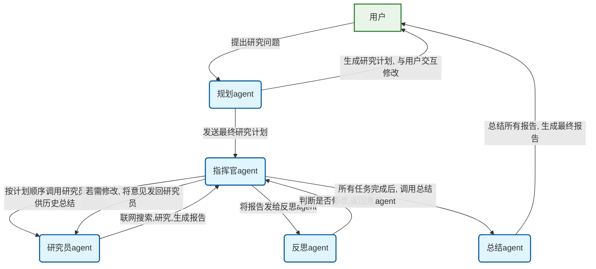
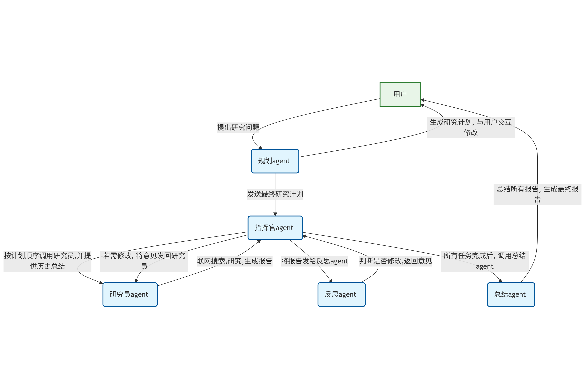

# 搜索类agent探索

本项目旨在探索使用agno框架实现的探索类agent。本文档记录对项目的初步设计以及后续落地，既为人类用户编写，也为AI编程工具提供参考。

## 参考资料

### Agno相关
[总览,提供了一个research agent的基本信息](https://docs.agno.com/agents/introduction)
[运行Agent](https://docs.agno.com/agents/run)
[prompt](https://docs.agno.com/agents/prompts)
[使用工具](https://docs.agno.com/agents/tools)
[多agent team](https://docs.agno.com/teams/introduction)
[工作流](https://docs.agno.com/workflows_2/types_of_workflows)

## 安装及运行

### 安装
```bash
pip install -r requirements.txt
```

### 运行
```bash
python main.py #按照返回指示添加其他参数
```


## 环境（向AI说明，仅限于开发者本人适用）
在执行测试代码前
```bash
conda activate agno-env
```

## 项目设计

* .env文件存放有环境变量，因为比较敏感所以设置了忽略，下面介绍一下里面的字段
    * OPENAI_API_KEY存放有api key
    * OPENAI_API_BASE_URL存放有api base url
    * TAVILY_API_KEY存放有tavily api key，用于Tavily搜索工具
* src/custom_tools存放有自定义的工具
* src/explore是之前实验、探索agno使用方法的代码，之后的实现也可以参考
* reference是agno agent的具体实现(从agno包直接拷贝过来)
* 接下来项目的实现主要放在src文件夹下，每个文件夹代表一种实验
* 在prompts文件夹下存储prompt模板。在python代码中开发时，应将prompt模板的实现与代码分离，prompt模板的实现应放在prompts文件夹下，而python代码应放在src文件夹下。prompts的具体要求参考[Prompt设计规范](#prompt设计规范)
* 搜索工具使用Tavily API，需要在.env文件中配置TAVILY_API_KEY。使用agno.tools.tavily.TavilyTools().设置include_answer=False,format='json'以使其返回原始搜索结果.并将使用google搜索的代码以注释形式写在下一行，方便备选，例如：
```python
agent = Agent(
...#其它参数
tools=[TavilyTools(include_answer=False,format='json')], 
#tools=[GoogleSearchTools(fixed_max_results=10)],
show_tool_calls=True)

```
* 对于AI工具来说，除非我明确，否则在开发完成后不用进行程序的运行和测试，而是将相关指令告诉我，由我来手动运行和测试

## Prompt设计规范

在设计prompt时，需要遵循以下规范：
* **prompt模板格式**：prompt模板应该以json形式创建。agno的模板可以分为description,instructions,goal等部分,具体可以参考[运行Agent](https://docs.agno.com/agents/run)这篇参考资料。对于我们这个项目，应当包含
    * description: 简要描述agent的角色及任务
    * instructions: 详细说明agent的工作流程、有哪些工具等
    * goal: 说明agent的目标
    * additional_context: 在这一部分加入限制条件，明确agent不能做什么（例如输出有害信息），以及其它限制（例如如果有调用外部工具次数的限制）
* **搜索工具语言设置**：由于都是国外的搜索工具，所以在使用时，除非是涉及到中国的内容，否则关键词最好是英文，区域/语言设置成英语。
* **语言适配指令**：应该添加根据用户提问语言选择回答语言的指令，即如果用户用中文提问则用中文回答，如果用户用英文提问则用英文回答。

## 开发目标

### 简单搜索agent

1. [ ]实现一个简单的搜索agent，在这个agent内，用户可以输入一个问题，agent会自主调用搜索工具，搜索相关内容，最后返回总结的结果。限制只能调用一次工具
    1.1 [ ] 基本的搜索-总结内容实现
    1.2 [ ] 给search_and_read工具增加储存功能，把搜索到的内容储存到一个文件中
    1.3 [ ] 调整prompt，让模型在总结内容时，将生成内容与搜索结果相关的部分加上引用角标，引用角标格式为[1]、[2]等；在生成结果的末尾加上所有搜索结果的标题和链接
2. [ ] 实现一个搜索工作流。这个工作流包括多个agent，先用小模型生成提示词，接着使用搜索工具搜索相关内容，最后用大模型总结搜索结果

### deep research应用

实现一个deep reseaarch应用，这个应用的目标是根据用户输入的问题，自动生成一个研究计划，调用多个不同的agent进行合作，为用户生成一篇研究报告

#### 涉及agent
1. 规划agent: 这个agent首先会根据用户输入的问题，根据情况使用联网搜索工具，生成一个结构化的研究计划，该研究计划包含若干个子任务，并与用户进行交互，最后根据用户的反馈，调整研究计划。
2. 指挥官agent: 确定研究计划后，这个agent会按研究计划的顺序，调用研究员agent对一个子任务进行联网搜索与研究；在研究员agent将结果返回后，把研究结果提供给反思agent，让它来确定是否应该修改，如果应该修改，将修改意见提供给研究员agent让它继续生成，直到反思agent确定不再需要修改或达到最大次数为止。接下来，将之前所有研究员agent的研究结果做一个总结，连同本轮任务提供给下一个研究员agent，让它继续研究。
3. 研究员agent： 这个agent的任务是根据指挥官agent提供的子任务，调用搜索工具进行联网搜索，搜索到相关内容后生成它这一部分的研究报告，提供给指挥官agent。如果指挥官agent反馈说需要进行修改，那么应根据反馈结果进行进一步的研究。研究员agent应将搜索到的内容储存起来，并做好引用的标注
4. 反思agent: 这个agent的任务是根据指挥官agent提供的子任务，以及研究员agent提供的研究报告，判断是否需要修改。如果需要修改，应根据研究员agent的研究报告，生成修改意见。
5. 总结agent： 这个agent的任务是根据指挥官agent提供的子任务，以及所有研究员agent的研究报告，生成最终的研究报告。研究报告应该根据一定的格式（以后再完善）生成。

#### 示意图



