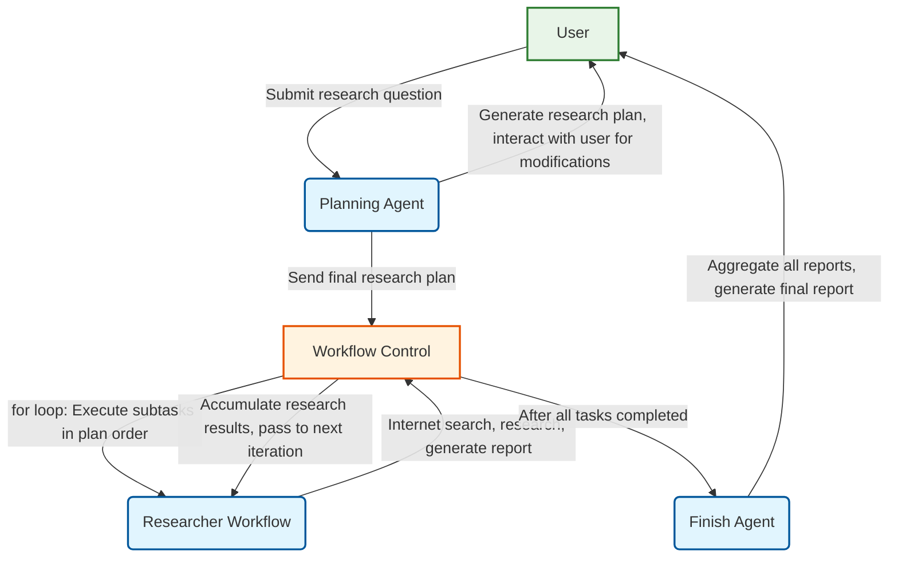

# Search Agent Exploration

[中文版](readme.md) | **English**

This project aims to explore search-type agents implemented using the Agno framework. This document records the initial design and subsequent implementation of the project, written for both human users and AI programming tools.

> **Note**: This project is primarily developed in Chinese. English-related prompt content and documentation will be gradually supplemented in future updates.

## References

### Agno Related
* [Overview, provides basic information about research agents](https://docs.agno.com/agents/introduction)
* [Running Agents](https://docs.agno.com/agents/run)
* [Prompts](https://docs.agno.com/agents/prompts)
* [Using Tools](https://docs.agno.com/agents/tools)
* [Multi-agent Teams](https://docs.agno.com/teams/introduction)
* [Workflows](https://docs.agno.com/workflows_2/types_of_workflows)

## Installation and Running

### Installation
```bash
pip install -r requirements.txt
```

### Running

`main.py` is the unified command-line entry point for the project, providing an interface to run various AI agents. It has the following features:

- **Unified Entry**: Select different agents through command-line parameters
- **Agent Management**: Automatically detect and manage available agents
- **Error Handling**: Provide friendly error messages and usage tips
- **Interactive Interface**: Includes project banner and detailed help information

#### Basic Usage
```bash
# View all available agents
python main.py --list

# Run simple search agent
python main.py simple-search

# Run planning agent
python main.py planning

# Run researcher agent
python main.py researcher

# View help information
python main.py --help

# View version information
python main.py --version
```

#### Currently Supported Agents
- **simple-search**: Simple Search Agent, uses search tools and summarizes web content
- **workflow-search**: Search Workflow Agent, completes search tasks through multi-agent workflow (query generation -> search -> summarization)
- **planning**: Planning Workflow v2.0, uses fixed tool flow architecture: plan generation -> plan display -> feedback evaluation -> structured output, supports human-machine interaction and plan iterative optimization
- **researcher-workflow**: Researcher Workflow, implements detailed report generation and summary generation through a two-step workflow, supports multi-round search, citation annotation, and feedback modification features
- **deep-research**: Complete deep research system, integrates planning, research, and summarization phases, automatically generates structured research reports with detailed reference management and final report generation


## Environment (For AI tools, developer-specific)
Before executing test code:
```bash
conda activate agno-env
```

## Deep Research System Architecture

### System Overview
The Deep Research system is a complete AI-driven research tool that can automatically generate research plans, conduct in-depth investigations, and produce structured research reports based on user input research questions. The system adopts a multi-agent collaborative architecture with the following core components:

### Core Components

#### 1. Planning Agent
- **File Location**: `src/deep_research/planning_agent.py`
- **Function**: Generates structured research plans based on user questions, supports human-machine interactive optimization
- **Workflow**: Plan generation → Plan display → User feedback → Plan adjustment → Final confirmation
- **Output**: JSON format research plan containing title, overview, and subtask list

#### 2. Researcher Workflow
- **File Location**: `src/deep_research/researcher_workflow.py`
- **Function**: Executes specific research tasks, generates detailed reports and summaries
- **Workflow**: Query generation → Internet search → Report writing → Summary generation
- **Output**: Detailed research reports (Markdown), research summaries, search result storage

#### 3. Finish Agent
- **File Location**: `src/deep_research/finish_agent.py`
- **Function**: Aggregates all research results and generates the final complete research report
- **Components**: Title-intro generator, conclusion generator, reference generator
- **Output**: Complete research report including introduction, detailed content, conclusion, and references

#### 4. Reference Management System
- **File Location**: `src/reference_manager/`
- **Function**: Manages storage, indexing, and citation annotation of search results
- **Features**: Automatic citation mark generation, multiple citation format support, duplicate prevention storage

### Output Structure

The system creates independent output directories for each research task, containing the following files:

```
<task_id>/
├── research_plan.json          # Research plan
├── all_research_results.json   # All research results summary
├── final_report.md            # Final research report
├── research_reports/          # Detailed reports for each subtask
│   ├── detailed_report_*.md   # Detailed research reports
│   └── summary_*.md          # Research summaries
├── references/               # Reference materials
│   └── references_*.json     # Search results and citation data
└── summaries/               # Phased summaries (optional)
```

### Example Output

The project includes complete example output (`example_task/`) demonstrating systematic research on "Deep Learning History":
- **Research Plan**: 6 subtasks covering deep learning development from 1943 to 2025
- **Detailed Reports**: Each subtask generates approximately 3000-5000 word in-depth analysis reports
- **Final Report**: Over 20,000 word complete research report including introduction, detailed analysis, conclusion, and references
- **Reference Management**: Automatically annotated citation indexes and complete reference lists

## Project Design

* The .env file contains environment variables. Since they are sensitive, they are ignored. Here are the fields:
    * OPENAI_API_KEY stores the API key
    * OPENAI_API_BASE_URL stores the API base URL
    * TAVILY_API_KEY stores the Tavily API key for the Tavily search tool
* `src/custom_tools` contains custom tools.
* `src/explore` contains previous experimental code for exploring Agno usage methods, which can be referenced for future implementations.
* `reference` contains the specific implementation of Agno agents (copied directly from the Agno package).
* Future project implementations will mainly be placed in the `src` folder, with each folder representing an experiment.
* Prompt templates are stored in the `prompts` folder. During Python development, the implementation of prompt templates should be separated from the code. Prompt templates should be placed in the `prompts` folder, while Python code should be in the `src` folder. For specific prompt requirements, refer to [Prompt Design Specifications](#prompt-design-specifications).
* The search tool uses `tavily_tools_with_index` from `custom_tools`, which requires configuring `TAVILY_API_KEY` in the `.env` file. Set `include_answer=False` and `format='json'` to have it return raw search results. The code for using Google search should be written as a comment on the next line as a backup option, for example:
```python
from custom_tools.tavily_tools_with_index import TavilyToolsWithIndex
agent = Agent(
...# other parameters
tools=[TavilyToolsWithIndex(include_answer=False,format='json')], 
#tools=[GoogleSearchTools(fixed_max_results=10)],
show_tool_calls=True)
```
* For AI tools, unless I explicitly state otherwise, do not run and test the program after development is complete. Instead, provide the relevant commands to me, and I will run and test them manually.

## Prompt Design Specifications

When designing prompts, the following specifications should be followed:
* **Prompt Template Format**: Prompt templates should be created in JSON format. An Agno template can be divided into `description`, `instructions`, `goal`, etc. For details, refer to the [Running Agents](https://docs.agno.com/agents/run) documentation. For our project, it should include:
    * `description`: A brief description of the agent's role and task.
    * `instructions`: A detailed explanation of the agent's workflow, available tools, etc.
    * `goal`: A description of the agent's objective.
    * `additional_context`: This section is for adding constraints, clarifying what the agent cannot do (e.g., output harmful information), and other limitations (e.g., limits on external tool calls).
* **Search Tool Language Settings**: Since the search tools are international, keywords should preferably be in English, with the region/language set to English, unless the content is specifically about China.
* **Language Adaptation Instructions**: Instructions should be added to select the response language based on the user's query language. That is, respond in Chinese if the user asks in Chinese, and in English if the user asks in English.

## Development Goals

### Simple Search Agent

- [x] 1. Implement a simple search agent. In this agent, a user can input a question, and the agent will autonomously call a search tool to find relevant content, finally returning a summarized result. The tool call is limited to one.
    - [x] 1.1 Basic implementation of search-and-summarize content.
    - [x] 1.2 Add a storage feature to the search tool to save the searched content to a file.
    - [x] 1.3 Adjust the prompt to make the model add citation markers (e.g., `[1]`, `[2]`) to the parts of the summary related to the search results, and append the titles and links of all search results at the end.
- [x] 2. Implement a search workflow. This workflow includes multiple agents: first, a small model generates search queries; then, a search tool is used to search for relevant content; finally, a large model summarizes the search results.

### Deep Research Application

Implement a deep research application that automatically generates a research plan based on user input questions, calls multiple different agents for cooperation, and generates a research report for users

#### Involved Agents
1. Planning Agent: This agent first generates a structured research plan based on user input questions, optionally using internet search tools. The research plan contains several subtasks and interacts with users, finally adjusting the research plan based on user feedback.
2. Researcher Agent: This agent's task is to conduct internet searches using search tools based on provided subtasks, generate research reports for its part after searching relevant content. The researcher agent should store searched content and properly annotate citations. Through a for loop, it executes each subtask in the research plan sequentially, receiving a summary of all previous research results as context for each execution.
3. Summarizer Agent: This agent's task is to generate the final research report based on research reports from all researcher agents. The research report should be generated according to a certain format (to be refined later).

#### Development Plan and Implementation Status

- [x] **1. Implement Planning Agent ✅**
    - [x] 1.1 Create planning agent prompt template (v2.0: plan_generator_agent.json, feedback_evaluator_agent.json)
    - [x] 1.2 Implement planning agent core logic (v2.0: refactored to workflow architecture)
    - [x] 1.3 Integrate search tools for background information collection (Tavily search tool)
    - [x] 1.4 Implement human-machine interaction plan confirmation mechanism (fixed tool flow design)
    - [x] 1.5 Add plan display and feedback collection functionality (independent display and evaluation components)
    - [x] 1.6 Test planning agent functionality completeness (v2.0 test files)

- [x] **2. Implement Researcher Agent ✅**
    - [x] 2.1 Create agent basic structure (researcher_workflow.py)
    - [x] 2.2 Integrate internet search tools (TavilyToolsWithIndex)
    - [x] 2.3 Implement functionality to generate research reports based on subtasks (workflow architecture)
    - [x] 2.4 Implement search result storage and citation annotation (ReferenceManager integration)
    - [x] 2.5 Implement functionality to modify reports based on feedback
    - [x] 2.6 Implement separate generation and storage of detailed reports and summaries

- [x] **3. Implement Finish Agent ✅**
    - [x] 3.1 Create agent basic structure (finish_agent.py)
    - [x] 3.2 Define final research report format (title + introduction + detailed reports + conclusion + references)
    - [x] 3.3 Implement functionality to aggregate all research results and generate final report
    - [x] 3.4 Integrate title-intro generator, conclusion generator, and reference generator

- [x] **4. Implement Workflow Control Logic ✅**
    - [x] 4.1 Implement for loop to control researcher agents executing tasks in plan order (deep_researcher.py)
    - [x] 4.2 Implement research result accumulation and transfer mechanism (all_research_results.json)
    - [x] 4.3 Implement data flow between agents (JSON file storage and reading)
    - [x] 4.4 Integrate reference management system (ReferenceManager)

- [x] **5. Integration and Testing ✅**
    - [x] 5.1 Integrate all agents into a complete workflow (DeepResearcher class)
    - [x] 5.2 Improve `main.py` to run deep research application
    - [x] 5.3 Generate complete example output (example_task folder)
    - [x] 5.4 Implement interactive research process

#### System Workflow Diagram
