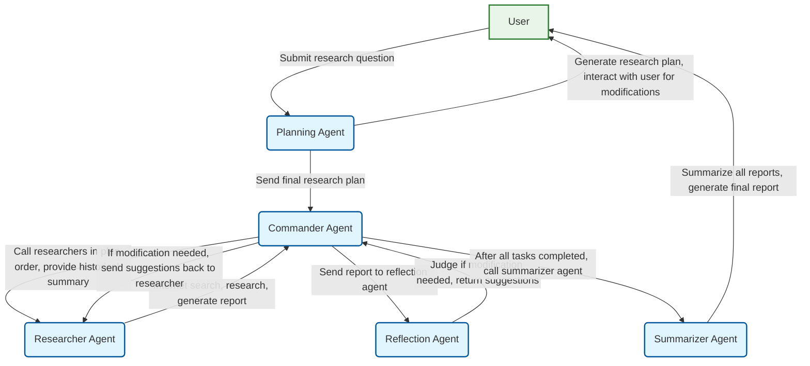

# Search Agent Exploration

[中文版](readme.md) | **English**

This project aims to explore search-type agents implemented using the Agno framework. This document records the initial design and subsequent implementation of the project, written for both human users and AI programming tools.

> **Note**: This project is primarily developed in Chinese. English-related prompt content and documentation will be gradually supplemented in future updates.

## References

### Agno Related
* [Overview, provides basic information about research agents](https://docs.agno.com/agents/introduction)
* [Running Agents](https://docs.agno.com/agents/run)
* [Prompts](https://docs.agno.com/agents/prompts)
* [Using Tools](https://docs.agno.com/agents/tools)
* [Multi-agent Teams](https://docs.agno.com/teams/introduction)
* [Workflows](https://docs.agno.com/workflows_2/types_of_workflows)

## Installation and Running

### Installation
```bash
pip install -r requirements.txt
```

### Running

`main.py` is the unified command-line entry point for the project, providing an interface to run various AI agents. It has the following features:

- **Unified Entry**: Select different agents through command-line parameters
- **Agent Management**: Automatically detect and manage available agents
- **Error Handling**: Provide friendly error messages and usage tips
- **Interactive Interface**: Includes project banner and detailed help information

#### Basic Usage
```bash
# View all available agents
python main.py --list

# Run simple search agent
python main.py simple-search

# Run planning agent
python main.py planning

# Run researcher agent
python main.py researcher

# View help information
python main.py --help

# View version information
python main.py --version
```

#### Currently Supported Agents
- **simple-search**: Simple Search Agent, uses search tools and summarizes web content
- **planning**: Planning Workflow v2.0, uses fixed tool flow architecture: plan generation -> plan display -> feedback evaluation -> structured output, supports human-machine interaction and plan iterative optimization
- **researcher**: Researcher Agent, executes deep research tasks, supports multi-round search, report generation, citation annotation, and feedback modification features


## Environment (For AI tools, developer-specific)
Before executing test code:
```bash
conda activate agno-env
```

## Project Design

* The .env file contains environment variables. Since they are sensitive, they are ignored. Here are the fields:
    * OPENAI_API_KEY stores the API key
    * OPENAI_API_BASE_URL stores the API base URL
    * TAVILY_API_KEY stores the Tavily API key for the Tavily search tool
* `src/custom_tools` contains custom tools.
* `src/explore` contains previous experimental code for exploring Agno usage methods, which can be referenced for future implementations.
* `reference` contains the specific implementation of Agno agents (copied directly from the Agno package).
* Future project implementations will mainly be placed in the `src` folder, with each folder representing an experiment.
* Prompt templates are stored in the `prompts` folder. During Python development, the implementation of prompt templates should be separated from the code. Prompt templates should be placed in the `prompts` folder, while Python code should be in the `src` folder. For specific prompt requirements, refer to [Prompt Design Specifications](#prompt-design-specifications).
* The search tool uses `tavily_tools_with_index` from `custom_tools`, which requires configuring `TAVILY_API_KEY` in the `.env` file. Set `include_answer=False` and `format='json'` to have it return raw search results. The code for using Google search should be written as a comment on the next line as a backup option, for example:
```python
from custom_tools.tavily_tools_with_index import TavilyToolsWithIndex
agent = Agent(
...# other parameters
tools=[TavilyToolsWithIndex(include_answer=False,format='json')], 
#tools=[GoogleSearchTools(fixed_max_results=10)],
show_tool_calls=True)
```
* For AI tools, unless I explicitly state otherwise, do not run and test the program after development is complete. Instead, provide the relevant commands to me, and I will run and test them manually.

## Prompt Design Specifications

When designing prompts, the following specifications should be followed:
* **Prompt Template Format**: Prompt templates should be created in JSON format. An Agno template can be divided into `description`, `instructions`, `goal`, etc. For details, refer to the [Running Agents](https://docs.agno.com/agents/run) documentation. For our project, it should include:
    * `description`: A brief description of the agent's role and task.
    * `instructions`: A detailed explanation of the agent's workflow, available tools, etc.
    * `goal`: A description of the agent's objective.
    * `additional_context`: This section is for adding constraints, clarifying what the agent cannot do (e.g., output harmful information), and other limitations (e.g., limits on external tool calls).
* **Search Tool Language Settings**: Since the search tools are international, keywords should preferably be in English, with the region/language set to English, unless the content is specifically about China.
* **Language Adaptation Instructions**: Instructions should be added to select the response language based on the user's query language. That is, respond in Chinese if the user asks in Chinese, and in English if the user asks in English.

## Development Goals

### Simple Search Agent

- [x] 1. Implement a simple search agent. In this agent, a user can input a question, and the agent will autonomously call a search tool to find relevant content, finally returning a summarized result. The tool call is limited to one.
    - [x] 1.1 Basic implementation of search-and-summarize content.
    - [x] 1.2 Add a storage feature to the search tool to save the searched content to a file.
    - [x] 1.3 Adjust the prompt to make the model add citation markers (e.g., `[1]`, `[2]`) to the parts of the summary related to the search results, and append the titles and links of all search results at the end.
- [x] 2. Implement a search workflow. This workflow includes multiple agents: first, a small model generates search queries; then, a search tool is used to search for relevant content; finally, a large model summarizes the search results.

### Deep Research Application

Implement a deep research application that automatically generates a research plan based on user input questions, calls multiple different agents for cooperation, and generates a research report for users

#### Involved Agents
1. Planning Agent: This agent first generates a structured research plan based on user input questions, optionally using internet search tools. The research plan contains several subtasks and interacts with users, finally adjusting the research plan based on user feedback.
2. Commander Agent: After determining the research plan, this agent calls researcher agents in the order of the research plan to conduct internet searches and research on subtasks; after the researcher agent returns results, it provides research results to the reflection agent to determine if modifications are needed. If modifications are needed, it provides modification suggestions to the researcher agent for continued generation until the reflection agent determines no further modifications are needed or the maximum number of iterations is reached. Next, it summarizes all previous researcher agent research results and provides them along with the current task to the next researcher agent for continued research.
3. Researcher Agent: This agent's task is to conduct internet searches using search tools based on subtasks provided by the commander agent, generate research reports for its part after searching relevant content, and provide them to the commander agent. If the commander agent provides feedback requiring modifications, it should conduct further research based on the feedback. The researcher agent should store searched content and properly annotate citations.
4. Reflection Agent: This agent's task is to determine whether modifications are needed based on subtasks provided by the commander agent and research reports provided by the researcher agent. If modifications are needed, it should generate modification suggestions based on the researcher agent's research report.
5. Summarizer Agent: This agent's task is to generate the final research report based on subtasks provided by the commander agent and research reports from all researcher agents. The research report should be generated according to a certain format (to be refined later).

#### Development Plan

- [ ] **1. Implement Planning Agent**
    - [ ] 1.1 Create agent basic structure
    - [ ] 1.2 Integrate internet search tools
    - [ ] 1.3 Implement research plan generation logic
    - [ ] 1.4 Implement user interaction and plan adjustment functionality
- [x] **2. Implement Researcher Agent**
    - [x] 2.1 Create agent basic structure
    - [x] 2.2 Integrate internet search tools
    - [x] 2.3 Implement functionality to generate research reports based on subtasks
    - [x] 2.4 Implement search result storage and citation annotation
    - [x] 2.5 Implement functionality to modify reports based on feedback
- [ ] **3. Implement Reflection Agent**
    - [ ] 3.1 Create agent basic structure
    - [ ] 3.2 Implement logic to evaluate research reports
    - [ ] 3.3 Implement functionality to generate modification suggestions
- [ ] **4. Implement Commander Agent**
    - [ ] 4.1 Create agent basic structure
    - [ ] 4.2 Implement logic to call researcher agents in research plan order
    - [ ] 4.3 Implement logic to pass research reports and historical summaries to reflection agents and next researcher agents
    - [ ] 4.4 Implement workflow to handle reflection agent feedback (iterative modifications)
- [ ] **5. Implement Summarizer Agent**
    - [ ] 5.1 Create agent basic structure
    - [ ] 5.2 Define final research report format
    - [ ] 5.3 Implement functionality to aggregate all research results and generate final report
- [ ] **6. Integration and Testing**
    - [ ] 6.1 Integrate all agents into a complete workflow
    - [ ] 6.2 Write end-to-end test cases
    - [ ] 6.3 Improve `main.py` to run deep research application

#### Diagram
